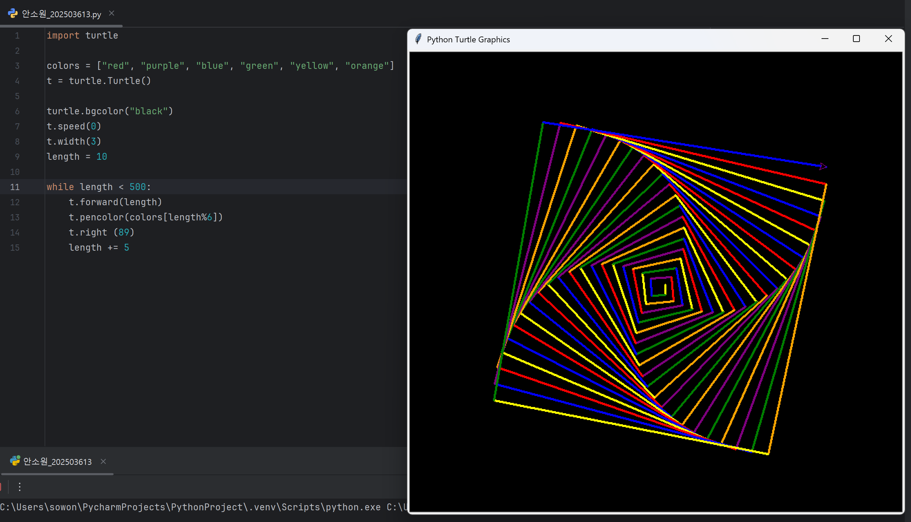
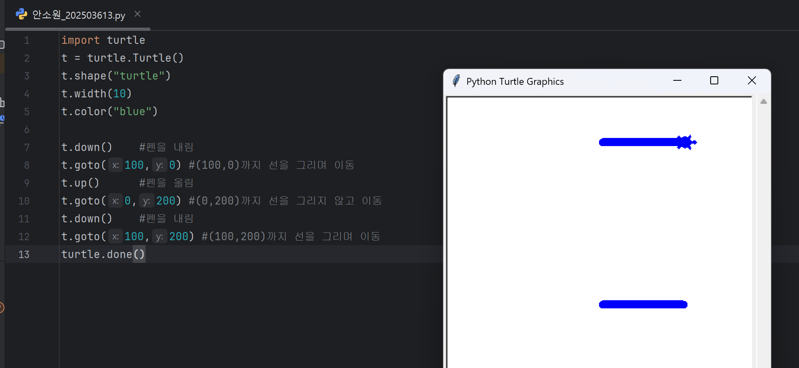
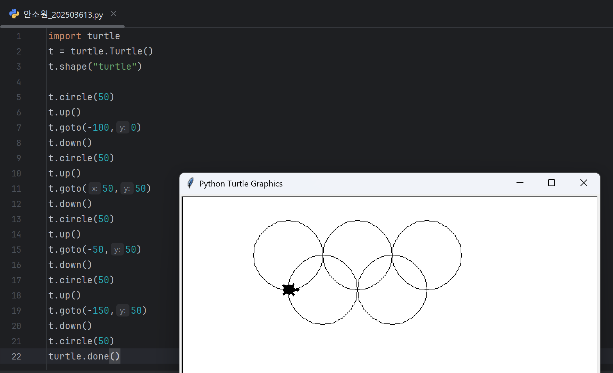
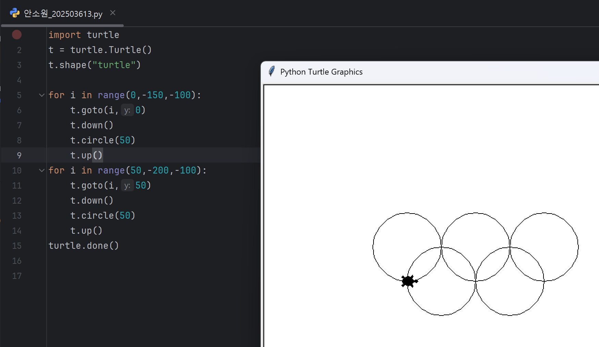

# 2025년 7월 18일 하기 모각코 기록

## 줌 회의 캡쳐본

## 목표
- 백준 1157번 문제 풀이 (Python 3 이용)
- "시간순삭 파이썬" 제2장 LAB03까지 실습
- 생성형 AI 대회 아이디어 Python 코드로 구현

## 1. 백준 1157번 문제 풀이
[백준 1157번 문제](https://www.acmicpc.net/problem/1157)

### 백준 1157번 문제 설명
입력된 단어에서 가장 많이 등장한 알파벳을 출력한다.  
대소문자 구분 없이 처리하며, 최댓값이 두 개 이상이면 `?`를 출력한다.

### 백준 1157번 풀이 방식

## 2. "시간순삭 파이썬" 제2장 LAB03까지 실습

### 제1장 13강
import turtle을 이용하여 정사각형, 정삼각형 외에도 다양한 모형을 그리고 최종적으로 다양한 색상을 이용한 그림도 구현해보았다.

 

### 제1장 Lab02
**정육각형의 경우**
t.forward(100)은 6번, t.left(60)는 5번 반복해야하고

**정팔각형의 경우**
360/8 = 45 이므로
t.forward(100)은 8번, t.left(40)는 7번 반복해야한다.

### 제1장 Lab03
두께가 10인 선을 그리기 위해서는 **t.width(10)**으로 해야하고
색상을 파란색으로 변경하려면 **t.color("blue")**로 해야하며
거북이의 모양을 사각형으로변경하려면 **t.shape("square")**로 해야한다.

터틀 그래픽의 좌표계는 수학의 평면좌표와 동일하게 (x,y)로 생각하면 된다.
화면 중앙이 원점 = (0,0)이 된다.

 

### 제1장 연습문제 3번

**Q. 지금까지 공부한 터틀 그래픽의 t.up(), t.down(), t.goto(), t.circle() 명령어를 조합하여 화면에 오륜기를 그리는 프로그램을 작성해 보시오.**

코드가 복잡해보여서 for i in range(): 반복문으로 바꾸어보았다.

 

## 3. 생성형 AI 아이디어 대회 준비

## 결과
- 백준 1157번 문제 풀이 및 파이썬 문법 공부
- 생성형 AI 대회 아이디어 정리 및 Python으로 구현 성공
