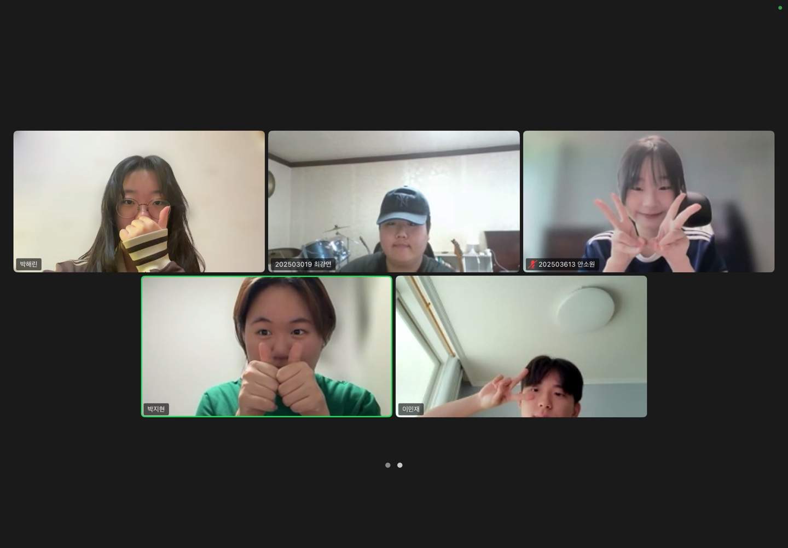

# 2025년 7월 18일 하기 모각코 기록

## 줌 회의 캡쳐본
[](../image/zoom0718.jpg) 


## 목표
- 백준 1157번 문제 풀이 (Python 3 이용)
- "시간순삭 파이썬" 제2장 LAB03까지 실습
- 생성형 AI 대회 아이디어 Python 코드로 구현

## 1. 백준 1157번 문제 풀이
[백준 1157번 문제](https://www.acmicpc.net/problem/1157)

### 백준 1157번 문제 설명
입력된 단어에서 가장 많이 등장한 알파벳을 출력한다.  
대소문자 구분 없이 처리하며, 최댓값이 두 개 이상이면 `?`를 출력한다.

### 백준 1157번 풀이 방식

## 2. "시간순삭 파이썬" 제2장 LAB03까지 실습

### 제1장 13강
import turtle을 이용하여 정사각형, 정삼각형 외에도 다양한 모형을 그리고 최종적으로 다양한 색상을 이용한 그림도 구현해보았다.

[](../image/Python1-13.png) 

### 제1장 Lab02
**정육각형의 경우**
t.forward(100)은 6번, t.left(60)는 5번 반복해야하고

**정팔각형의 경우**
360/8 = 45 이므로
t.forward(100)은 8번, t.left(40)는 7번 반복해야한다.

### 제1장 Lab03
두께가 10인 선을 그리기 위해서는 **t.width(10)**으로 해야하고
색상을 파란색으로 변경하려면 **t.color("blue")**로 해야하며
거북이의 모양을 사각형으로변경하려면 **t.shape("square")**로 해야한다.

터틀 그래픽의 좌표계는 수학의 평면좌표와 동일하게 (x,y)로 생각하면 된다.
화면 중앙이 원점 = (0,0)이 된다.

[](../image/Python1-Lab03.png) 

### 제1장 연습문제 3번

**Q. 지금까지 공부한 터틀 그래픽의 t.up(), t.down(), t.goto(), t.circle() 명령어를 조합하여 화면에 오륜기를 그리는 프로그램을 작성**

[](../image/practice1-3.png) 

코드가 너무 복잡해서 for i in range(): 반복문을 이용하여 수정해보았다.

[](../image/practice1-3_for.png) 


### 제2장 7강
파이썬에서 표준 입력을 받으려면 input() 함수를 사용한다.
input() 함수는 사용자로부터 입력받은 값을 모두 문자열로 저장한다.

```python
a = input()
print(a)
```
a = input() : 파이썬 내부에 변수 a가 생성되고 사용자로부터 입력받기 위해 커서가 깜박인다.

'5'를 입력하고 Enter 키를 치면 '5'가 문자열 형태로 저장된다.

```python
a = input("입력")
print(a)
```
위 코드는 a = input()을 통해 사용자로부터 입력을 받아 변수 a에 저장한다.

이때 커서가 깜박이며 입력을 기다리게 되고, 예를 들어 '5'를 입력하고 Enter를 누르면 문자열 "5"가 변수 a에 저장된다.

그 후 print(a)가 입력받은 값을 출력한다.

input()은 항상 문자열(str) 형태로 값을 저장한다.
숫자를 입력받고 싶으면 int(input())처럼 형변환이 필요하다.

### 제2장 8강

그대로 이어서 int(input())을 써보도록 하겠다.

앞에서 언급했듯이 input() 함수를 통해 들어온 값은 모두 문자열이다. 따라서 우리가 입력한 숫자들을 연산하는 데 사용하려면 수로 바꿔줘야한다.

정수면 정수로, 실수면 실수로 바꿔줘야한다는 말인데, **정수는 int()로 실수는 float()로 감싸주기**만 하면 된다.

```python
x = int(input("첫 번째 정수를 입력하시오: "))
y = int(input("두 번째 정수를 입력하시오: "))
sum = x + y
print(x, "과", y, "의 합은", sum, "입니다.")
```

## 3. 생성형 AI 아이디어 대회 준비
Sign in 화면과 Chat 화면 UI를 구상하고 이를 활용한 홈화면 구상을 팀원들과 상의해보았다.

<p align="center">
  
  
</p>

위는 나의 의견 중 일부이다.


## 결과
- 백준 1157번 문제 풀이 및 파이썬 문법 공부
- 생성형 AI 대회 아이디어 정리 및 Python으로 구현 성공
