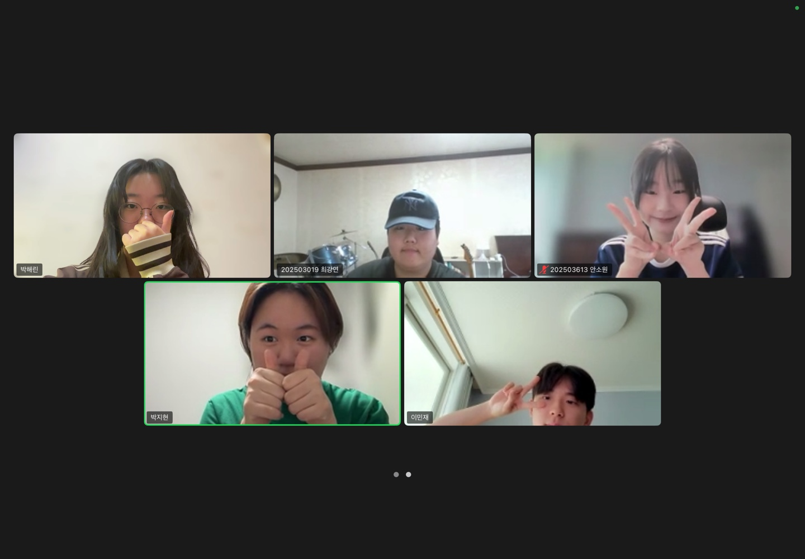

# 2025년 7월 30일 하기 모각코 기록

## 줌 회의 캡쳐본
[](../image/zoom0718.jpg) 


## 목표
- 백준 1058번 문제 풀이 (Python 3 이용)
- "시간순삭 파이썬" 제4장 LAB03까지 실습
- 생성형 AI 대회 아이디어 Python 코드로 구현

## 1. 백준 1058번 문제 풀이
```python
n = int(input())
adj = [input() for _ in range(n)]

max_count = 0

for i in range(n):
    friends = [False] * n

    for j in range(n):
        if i == j:
            continue
        if adj[i][j] == 'Y':
            friends[j] = True
        else:
            # 친구의 친구 검사
            for k in range(n):
                if adj[i][k] == 'Y' and adj[k][j] == 'Y':
                    friends[j] = True

    count = friends.count(True)
    max_count = max(max_count, count)

print(max_count)
```
