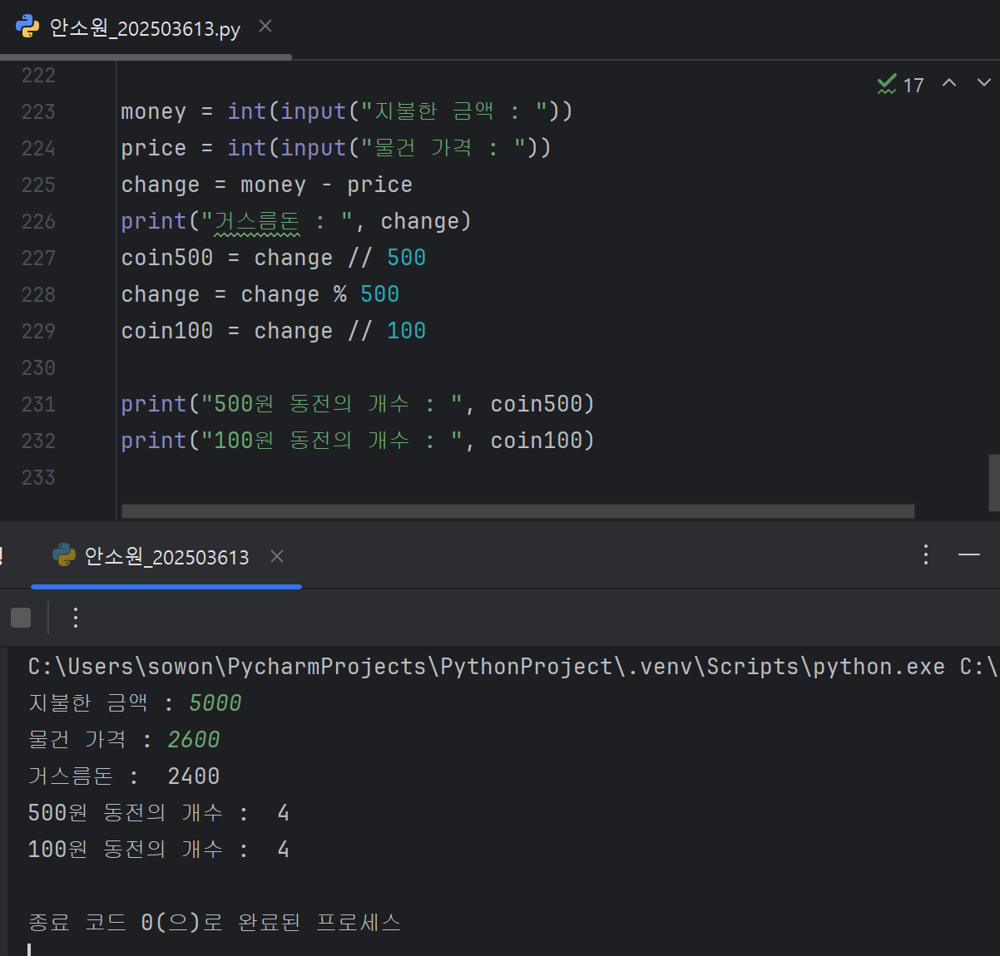
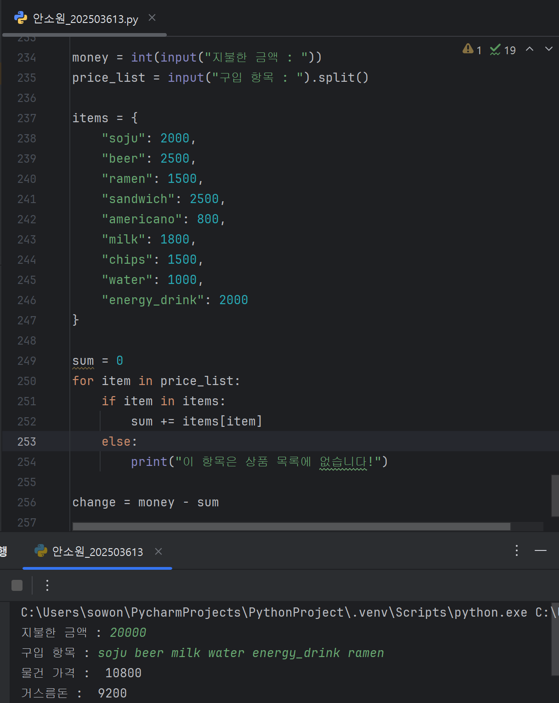
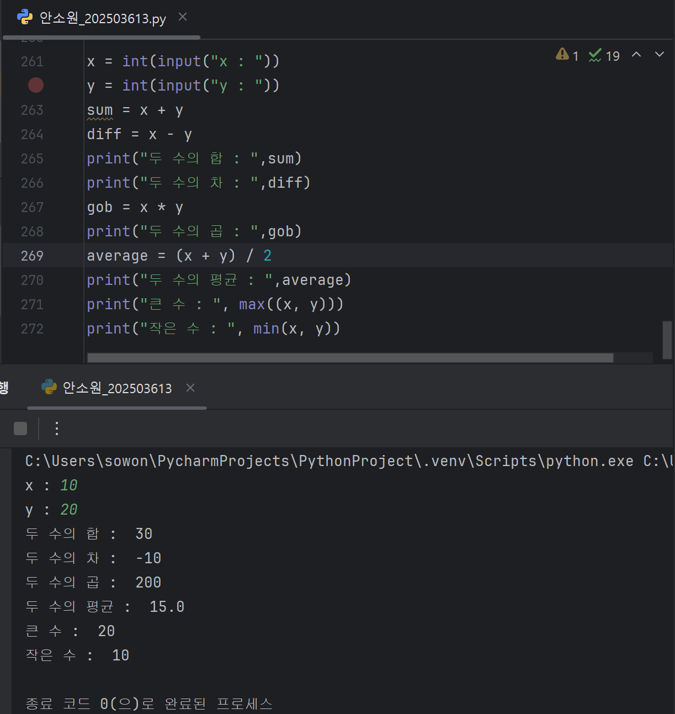

# 2025년 7월 31일 하기 모각코 기록

## 모각코 활동 사진
[](../image/모각코0731.jpg) 


## 목표
- 백준 1058번 문제 풀이 (Python 3 이용)
- "시간순삭 파이썬" 제4장 LAB03까지 실습

## 1. 백준 1058번 문제 풀이
### BaekJoon 1058번 문제
[백준 1058번](https://www.acmicpc.net/problem/1058)

### BaekJoon 1058번 문제요약
- **등장인물** : **N명**
- **입력** : 친구 관계가 'Y' 또는 'N'으로 주어진다.
- Y : 직접 친구
- N : 직접 친구가 아님
- **문제에서 묻는 것** : 각 사람마다 2-친구(직접 친구거나, 친구의 친구인 사람)의 수를 계산해서, 그 중에서 **가장 많은 2-친구 수**를 출력

- A랑 B랑 친구고, B랑 C랑 친구인데 A랑 C는 친구가 아닌 경우
- A와 C : **2-친구**

**예제 입력**
```
3
NYN
YNY
NYN
```

**분석**
- A : B랑 친구(Y), C랑은 아님(N)
- B : A랑 친구, C랑 친구
- C : B랑 친구
- A의 2-친구:
  - 직접 친구 : B
  - B의 친구 : A, C -> 여기서 A는 자기 자신이니까 제외 -> C는 2-친구
  - A의 2-친구 : B, C (2명)
 
**예제 출력**
```
2
```

### BaekJoon 1058번 풀이
**처음 내가 쓴 코드**
```python
n = int(input())
adj = [input() for _ in range(n)]

max_count = 0

for i in range(n):
  friends = [False] * n
    for j in range(n):
      if i == j:
          continue
      if adj[i][j] == 'Y':
          friends[j] = True
```
여기까지 쓰고 그 이후를 어떻게 써야할지 오래 고민했다.

처음 내가 쓴 코드는 직접 친구까지는 계산할 수 있으나

친구의 친구는 계산할 수 없었다.

그래서
```python
for k in range(n):
  if adj[i][k] == 'Y' and adj[k][j] == 'Y'
```
코드를 덧붙여줘야한다.

이렇게 할 경우 i - k - j 친구관계가 성립 되어 2-친구가 가능하다.

이 경우도
```python
friends[j] = True
```
코드를 넣어주어서 친구에 포함시킨다.

이렇게 지금까지 나온 True 수를 세고

여러 명 count 한 것 중에 가장 큰 값을 print 하기 위해
```python
  count = friends.count(True)
  max_count = max(max_count, count)

print(max_count)
```
코드를 마지막에 덧붙인다.

**최종 코드**
```python
n = int(input())
adj = [input() for _ in range(n)]

max_count = 0

for i in range(n):
    friends = [False] * n

    for j in range(n):
        if i == j:
            continue
        if adj[i][j] == 'Y':
            friends[j] = True
        else:
               for k in range(n):
                if adj[i][k] == 'Y' and adj[k][j] == 'Y':
                    friends[j] = True

    count = friends.count(True)
    max_count = max(max_count, count)

print(max_count)
```
## 2. "시간순삭 파이썬" 제4장 LAB03까지 실습
### "시간순삭 파이썬" 제3장 LAB05. 그리니치 표준시-세계 시간의 기준점
**Q.파이썬의 time()을 이용한 그리니치 표준시로 한국의 표준시를 구하는 프로그램을 작성해 보세요.**

- 파이썬에서 time()을 호출하면 1970년 1월 1일 이후 흘러온 전체 시간을 초 단위의 실숫값으로 반환받는다.
```python
import time
fseconds = time.time()
```


1. 컴퓨터는 1970년 1월 1일 0시 01분 0초부터 지금까지 몇 초 지났는지를 숫자로 갖고 있다.
   - ex. 1722489600초
2. 60초 = 1분이므로 ÷ 60 하면 전체 시간이 분 단위가 된다.
   - 1722489600 ÷ 60 = 28708160분
3. 한 시간은 60분이므로 전체 분에서 나머지를 구하면 현재 '분'이 나온다.
   - ex. 28707160 % 60 = 43분
   - 지금 시각의 분 단위는 43분.
4. 전체 분을 또 ÷ 60 하면 시 단위가 된다.
   - ex. 28708160 ÷ 60 = 478469시간
5. 그리니치 표준시(GMT)는 한국보다 9시간 느리다.
   - ex. 478469 + 9
6. 하루는 24시간이므로, **나머지 연산 % 24**를 해주면 지금 시각의 '시'가 나온다.
   - ex. (478469 + 9) % 24 = 14시
  
**최종결과**

- 시 : 14시 (오후2시)
- 분 : 43분

-> 현재 시간 = 오후 2시 43분

```python
import time
fseconds = time.time()
total_sec = int(fseconds)
total_min = total_sec // 60
minute = total_min % 60
total_hour = total_min // 60
hour = (total_hour + 9) % 24
print("현재 한국 시간: " + str(hour) + "시" + str(minute) + "분")
```
### "시간순삭 파이썬" 제3장 LAB06. 계산대 프로그램
**Q.물건의 가격과 지불한 금액을 입력하면 거스름돈을 알려주는 계산대 프로그램을 작성해보겠습니다.**

**이 때, 동전의 개수는 최소화**

- 조건1 : 물건값은 100원 단위
- 조건2 : 자판기는 동전 500원, 100원짜리만 가지고 있음



책에 있는 문제에 대해서는 이렇게만 작성해서 출력해도 되지만

좀 더 구체화해서 프로그램을 만들고 싶었기에 코드를 다시 짜보았다.
```python
money = int(input("지불한 금액 : "))
price_list = input("구입 항목 : ").split()

items = {
    "soju": 2000,
    "beer": 2500,
    "ramen_small": 1250,
    "ramen_big": 1500,
    "sandwich": 2500,
    "bento": 4500,
    "americano": 800,
    "milk": 1800,
    "chips": 1500,
    "candy": 500,
    "chocolate": 1200,
    "fried_chicken": 3500,
    "water": 1000,
    "energy_drink": 2000
}

sum = 0
for item in price_list:
    if item in items:
        sum += items[item]
    else:
        print("이 항목은 상품 목록에 없습니다!")

change = money - sum

print("물건 가격 : ",sum)
print("거스름돈 : ", change)
```
이렇게 코드를 짜는 경우


이런 식으로 다양한 항목을 넣어서 계산을 할 수 있다!

하지만 현재 진도로는 

아직 반복문을 나간 상태가 아니기에 사실상 이런 프로그램은 만들 수 없다.

```python
items = {
    "soju": 2000,
    "beer": 2500,
    "ramen": 1500,
    "sandwich": 2500,
    "americano": 800,
    "milk": 1800,
    "chips": 1500,
    "water": 1000,
    "energy_drink": 2000
}
```
특히나 딕셔너리도 사용했는데,
```python
# 딕셔너리 생성
items = {
    "soju": 2000,
    "beer": 2500,
    "ramen": 1500
}

# 값 접근
print(items["soju"])  # 2000

# 값 수정
items["soju"] = 2200

# 새로운 항목 추가
items["sandwich"] = 2500

# 항목 삭제
del items["beer"]

# 딕셔너리 전체 출력
print(items)
```
이것 또한 한참 뒤에 배우는 것이다...

프로그램을 만들기 위해서 컴퓨터프로그래밍1 수업 때 들은 내용을 떠올려 코드를 써내려갔다.

### "시간순삭 파이썬" 제3장 연습문제 01.
**Q. 사용자로부터 두 개의 정수를 받아서 정수의 합, 정수의 차, 정수의 곱, 정수의 평균, 큰 수, 작은 수를 계산하여 화면에 출력하는 프로그램을 작성해 보세요.**

**파이썬이 제공하는 내장 함수 max(x, y), min(x, y)을 활용하기**


**실행결과**
```
x : 10
y : 20
두 수의 합 : 30
두 수의 차 : -10
두 수의 곱 : 200
두 수의 평균 : 15.0
큰 수 : 20
작은 수 : 10
```



이런 식으로 코드를 짜면 실행된다.

그런데, 두 수의 차에서 마이너스가 붙는 게 신경쓰여서 다른 형식으로 코드를 작성해보기로 했다.

만약 코드를
```python
print("두 수의 차 : ",abs(diff))
```
으로 하는 경우

diff의 절댓값이 출력되어

```
두 수의 차 : 10
```
이런 식으로 결과값이 나온다!

## 결과
- 백준 1058번 문제 풀이 성공 및 이전 배삭 파이썬" 복습 및 제4장 LAB03까지 실습
