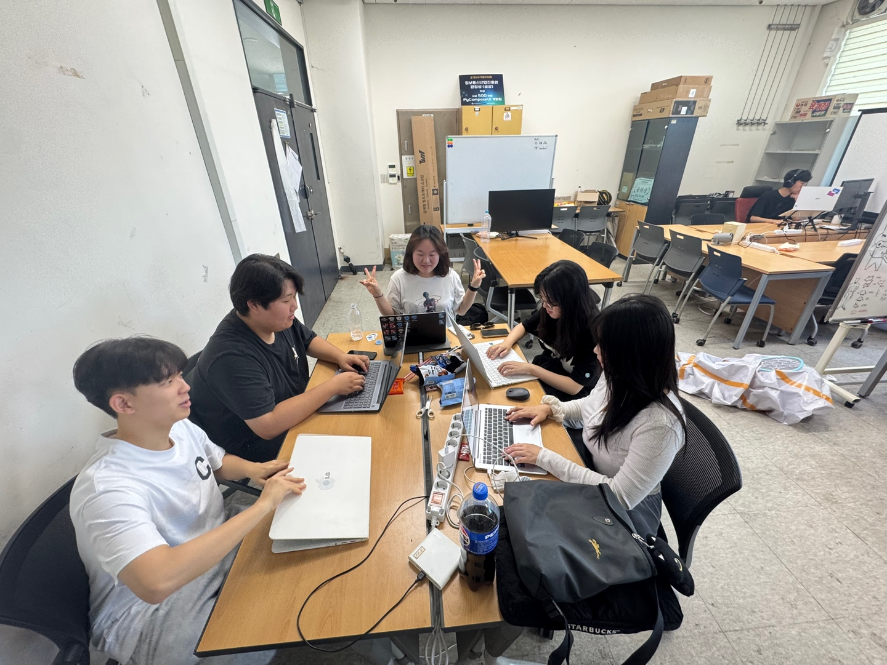

# 2025년 7월 31일 하기 모각코 기록

## 줌 회의 캡쳐본
[](../image/모각코0731.jpg) 


## 목표
- 백준 1058번 문제 풀이 (Python 3 이용)
- "시간순삭 파이썬" 제4장 LAB03까지 실습
- 생성형 AI 대회 아이디어 Python 코드로 구현

## 1. 백준 1058번 문제 풀이
### BaekJoon 1058번 문제
[백준 1058번](https://www.acmicpc.net/problem/1058)

### BaekJoon 1058번 문제요약
- **등장인물** : **N명**
- **입력** : 친구 관계가 'Y' 또는 'N'으로 주어진다.
- Y : 직접 친구
- N : 직접 친구가 아님
- **문제에서 묻는 것** : 각 사람마다 2-친구(직접 친구거나, 친구의 친구인 사람)의 수를 계산해서, 그 중에서 **가장 많은 2-친구 수**를 출력

- A랑 B랑 친구고, B랑 C랑 친구인데 A랑 C는 친구가 아닌 경우
- A와 C : **2-친구**

**예제 입력**
```
3
NYN
YNY
NYN
```

**분석**
- A : B랑 친구(Y), C랑은 아님(N)
- B : A랑 친구, C랑 친구
- C : B랑 친구
- A의 2-친구:
  - 직접 친구 : B
  - B의 친구 : A, C -> 여기서 A는 자기 자신이니까 제외 -> C는 2-친구
  - A의 2-친구 : B, C (2명)
 
**예제 출력**
```
2
```

### BaekJoon 1058번 풀이
**처음 내가 쓴 코드**
```python
n = int(input())
adj = [input() for _ in range(n)]

max_count = 0

for i in range(n):
  friends = [False] * n
    for j in range(n):
      if i == j:
          continue
      if adj[i][j] == 'Y':
          friends[j] = True
```
여기까지 쓰고 그 이후를 어떻게 써야할지 오래 고민했다.

처음 내가 쓴 코드는 직접 친구까지는 계산할 수 있으나

친구의 친구는 계산할 수 없었다.

그래서
```python
for k in range(n):
  if adj[i][k] == 'Y' and adj[k][j] == 'Y'
```
코드를 덧붙여줘야한다.

이렇게 할 경우 i - k - j 친구관계가 성립 되어 2-친구가 가능하다.

이 경우도
```python
friends[j] = True
```
코드를 넣어주어서 친구에 포함시킨다.

이렇게 지금까지 나온 True 수를 세고

여러 명 count 한 것 중에 가장 큰 값을 print 하기 위해
```python
  count = friends.count(True)
  max_count = max(max_count, count)

print(max_count)
```
코드를 마지막에 덧붙인다.

**최종 코드**
```python
n = int(input())
adj = [input() for _ in range(n)]

max_count = 0

for i in range(n):
    friends = [False] * n

    for j in range(n):
        if i == j:
            continue
        if adj[i][j] == 'Y':
            friends[j] = True
        else:
               for k in range(n):
                if adj[i][k] == 'Y' and adj[k][j] == 'Y':
                    friends[j] = True

    count = friends.count(True)
    max_count = max(max_count, count)

print(max_count)
```
