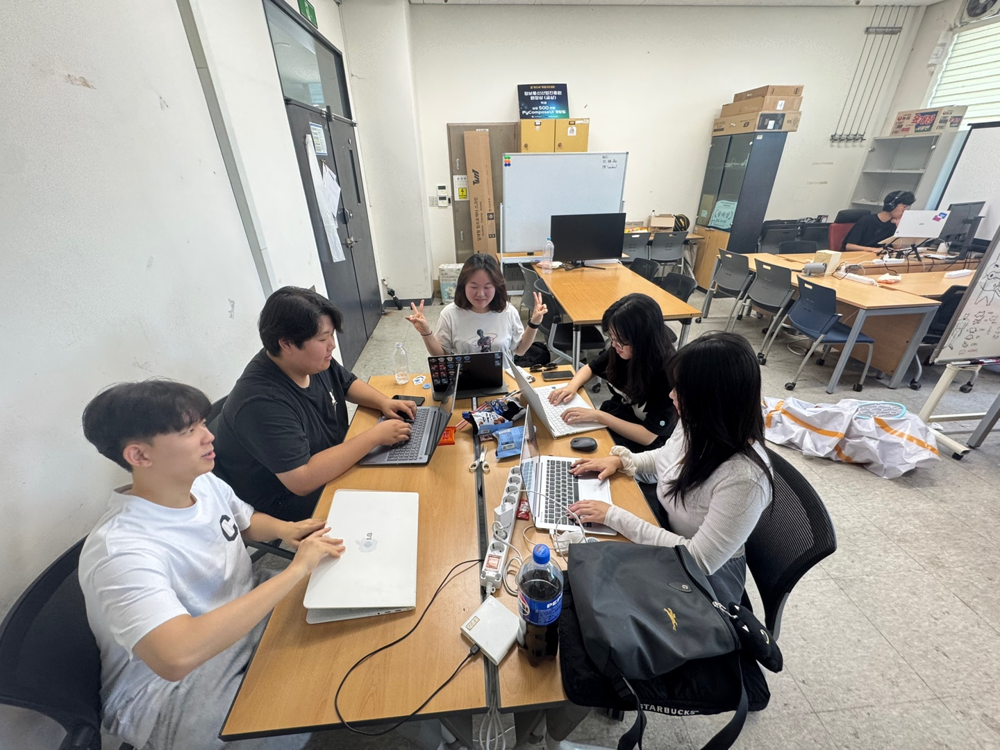

# 2025년 8월 2일 하기 모각코 기록

## 줌 회의 캡쳐본
[](../image/모각코0731.jpg) 


## 목표
- 백준 배열 문제 풀이 (Python 3 이용)
- "시간순삭 파이썬" 제5장 LAB03까지 실습

## 1. 백준 1024번 문제 풀이
### BaekJoon 1024번 문제
[백준 1024번](https://www.acmicpc.net/problem/1024)

### BaekJoon 1024번 문제요약
**입력**

- N : 원하는 수열의 합
- L : 수열의 최소 길이

**목표**
- 합이 N이 되는 연속된 음이 아닌 정수 수열을 찾기
- 수열의 길이는 최소 L 이상
- 가능한 수열이 여러 개면 가장 짧은 수열 출력
- 없으면 -1 출력

**과정**
- 우선 주어진 최소 길이 이상의 리스트를 짜야하므로
- for i in range(L, --): 구조를 사용해야한다.
- 문제는 연속된 수들의 합이 N이 된다는 조건인데,

- 연속된 정수 `a, a+1, ..., a+(l-1)`의 합 공식:
  
           2×length
a =   ㅡㅡㅡㅡㅡㅡㅡㅡㅡㅡㅡ
      2N−length×(length−1)
  
- 조건:
  1. `a`가 **정수**여야 함 (`numerator % denominator == 0`)
  2. `a >= 0` (음이 아닌 정수)
  3. `l`은 `L`부터 `100`까지 탐색 (가장 짧은 수열을 찾기 위해)


### BaekJoon 1024번 풀이
```python
n, l = map(int,input().split())

for length in range(l, 101):
    up = 2 * n - length * (length - 1)  # 분자
    down = 2 * length  # 분모

    if up % down == 0:
        a = up // down
        if a >= 0:
            print(' '.join(str(a + i) for i in range(length)))
            break
else:
    print(-1)
```
