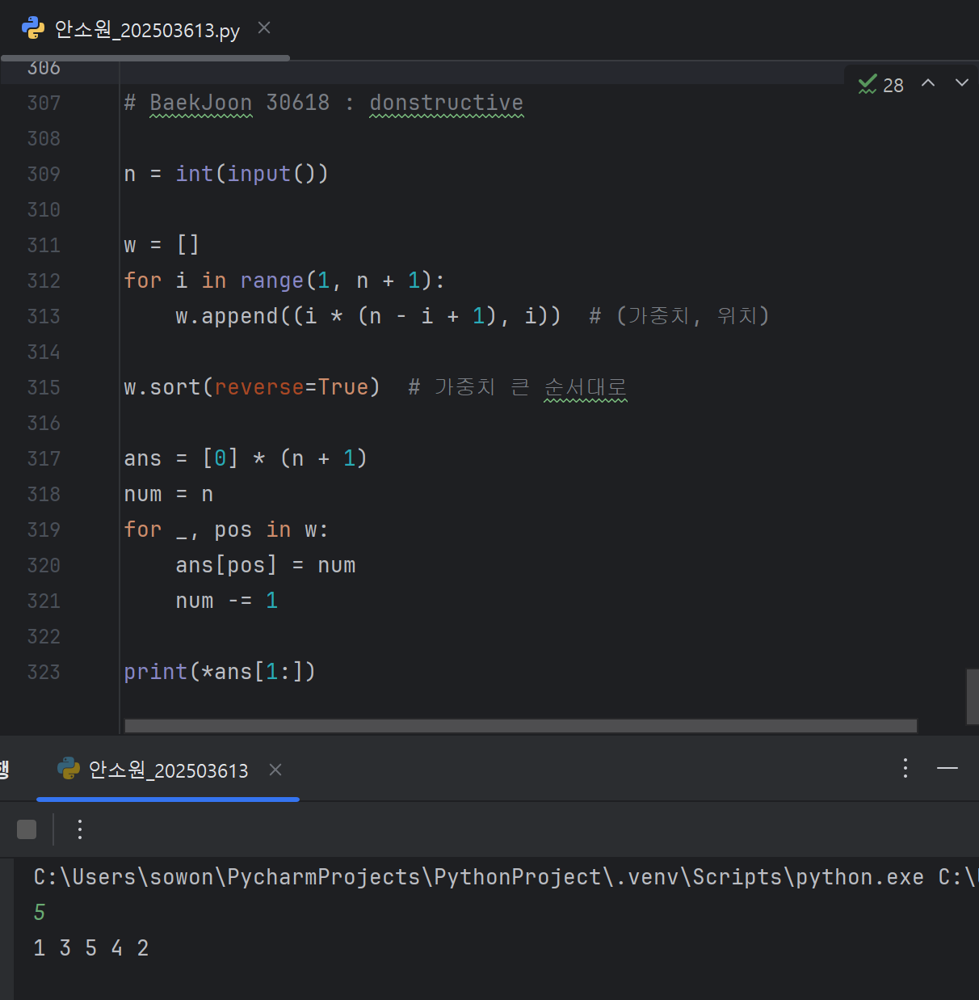

# 2025년 8월 2일 하기 모각코 기록

## 모각코 활동 사진
[](../image/모각코0802.jpg) 


## 목표
- 백준 배열 문제 풀이 (Python 3 이용)
- "시간순삭 파이썬" 제5장 LAB03까지 실습

## 1. 백준 1024번 문제 풀이
### BaekJoon 1024번 문제
[백준 1024번](https://www.acmicpc.net/problem/1024)

### BaekJoon 1024번 문제요약
**입력**

- N : 원하는 수열의 합
- L : 수열의 최소 길이

**목표**
- 합이 N이 되는 연속된 음이 아닌 정수 수열을 찾기
- 수열의 길이는 최소 L 이상
- 가능한 수열이 여러 개면 가장 짧은 수열 출력
- 없으면 -1 출력

**과정**
- 우선 주어진 최소 길이 이상의 리스트를 짜야하므로
- for i in range(L, --): 구조를 사용해야한다.
- 문제는 연속된 수들의 합이 N이 된다는 조건인데,

- 연속된 정수 `a, a+1, ..., a+(l-1)`의 합 공식:

  
  
- 조건:
  1. `a`가 **정수**여야 함 (`numerator % denominator == 0`)
  2. `a >= 0` (음이 아닌 정수)
  3. `l`은 `L`부터 `100`까지 탐색 (가장 짧은 수열을 찾기 위해)


### BaekJoon 1024번 풀이
```python
n, l = map(int,input().split())

for length in range(l, 101):
    up = 2 * n - length * (length - 1)  # 분자
    down = 2 * length  # 분모

    if up % down == 0:
        a = up // down
        if a >= 0:
            print(' '.join(str(a + i) for i in range(length)))
                break
        else:
            print(-1)
```


## 2. 백준 30618번 문제 풀이
### BaekJoon 30618번 문제
[백준 30618번](https://www.acmicpc.net/problem/30618)

### BaekJoon 30618번 문제요약
길이 **N**의 순열 \(P\)가 주어진다.  
점수 계산 방식은 다음과 같다.

1. 순열의 **모든 연속 부분 수열**을 구한다.
2. 각 부분 수열의 **원소 합**을 구한다.
3. 이 모든 합을 더한 값을 **순열의 점수**라고 한다.

> 목표: **점수가 최대가 되도록** 순열을 배치하라.

---

### BaekJoon 30618번 문제풀이
```python
n = int(input())

w = []
for i in range(1, n + 1):
    w.append((i * (n - i + 1), i))

w.sort(reverse=True)

ans = [0] * (n + 1)
num = n
for _, pos in w:
    ans[pos] = num
    num -= 1

print(*ans[1:])
```

문제를 푸는데 문제 자체가 이해가 너무 안 돼서 예시를 들어 생각해보았다.

우선,

P = [1,2,3] 일 때,
```
[1]
[2]
[3]
[1, 2]
[2, 3]
[1, 2, 3]
```
이고 이 합을 구해보면
```
1 + 2 + 3 + (1+2) + (2+3) + (1+2+3)
= 1 + 2 + 3 + 3 + 5 + 6 = 20
```
이다.

P = [a,b,c,d,e]가 있으면
```
a는 몇 개의 부분 수열에 포함될까?
  [a], [a,b], [a,b,c], [a,b,c,d], [a,b,c,d,e] 이런 식으로 5개이다.
b는?
  4 + 4 = 8개
c는?
  3 + 3 + 3 = 9개
d는?
  2 + 2 + 2 + 2 = 8개
e는?
  5개
```
즉, 가운데에 있는 요소가 가장 많이 중복된다.

이 말은 즉 **가운데에 가장 큰 수**가 와야 점수가 커진다는 것을 뜻한다!!

그런데 길이에 달라질수록 각 숫자가 점수에 기여하는 횟수도 달라질 것이다.

**그 횟수를 어떻게 계산해야할까?**

이걸 생각해내는 데 정말 많은 시간이 걸렸다.

우선 P = [a,b,c,d,e]의 예시를 가지고 생각해봤을 때
```
a : 1 × 5
b : 2 × 4
c : 3 × 3
d : 4 × 2
e : 5 × 1
```
이런 식으로 진행된다.

P = [a,b,c,d] 일 때도 생각을 해보면
```
a : 1 × 4
b : 2 × 3
c : 3 × 2
d : 4 × 1
```
비슷하게 흘러간다.

i번째 요소를 기준으로

i × (N - i + 1) 이런 식으로 각자 계산해주면 된다.

**하지만** 여기서 끝난 게 아니다.

가장 큰 횟수인 i 자리에 가장 큰 값을 넣어줘야 점수가 커지기 때문에

- 수열을 정리하여 가장 큰 값을 가장 큰 횟수에
- 두 번째 큰 값을 두 번째 큰 횟수에

이런 식으로 재정렬해준다.

우선 n에 5를 넣으면 w라는 리스트에
```python
for i in range(1, n + 1):
    w.append((i * (n - i + 1), i))
```
아까 구했던 공식을 활용하여 이런 코드를 작성해준다.

그 결과,
```
w = [
    (5, 1),  # 1번 위치의 가중치
    (8, 2),  # 2번 위치의 가중치
    (9, 3),  # 3번 위치의 가중치
    (8, 4),  # 4번 위치의 가중치
    (5, 5)   # 5번 위치의 가중치
]
```
이런 식으로 저장된다.

그럼 이제 (가중치, 위치)쌍을 가중치 기준 내림차순 정렬을 해준다.

```python
w.sort(reverse=True)
```
정렬을 했으니 이제 가중치 순서대로 위치를 꺼내 쓸 것이다.
```python
ans = [0] * (n + 1)
num = n
for _, pos in w:
  ans[pos] = num
  num -= 1
```
_, pos는 가중치 값은 무시하고 위치만 파악해서 계산하기 위해 썼다.

사실상 for pos in [3, 4, 2, 5, 1]: 과 같다.

처음에 ans라는 리스트에 [0,0,0,0,0,0] 이런 식으로 초기화를 했었는데

for 반복문을 통해
```
처음: ans = [0, 0, 0, 0, 0, 0] 
pos = 3, num = 5 → ans[3] = 5 → [0, 0, 0, 5, 0, 0]
pos = 4, num = 4 → ans[4] = 4 → [0, 0, 0, 5, 4, 0]
pos = 2, num = 3 → ans[2] = 3 → [0, 0, 3, 5, 4, 0]
...
이런 식으로 진행된다.

이제
```python
print(*ans[1:])
```
코드를 넣어 재배열된 원소들을 print하면 된다!

이 때, [1:]이라고 쓴 이유는 ans[0]이 0이기 때문이다.

초기화할 때 n보다 1 큰 값을 넣어서 했기 때문에 항상 0이 남게 된다.

**최종 결과**

[](../image/bj30618.png) 

## 결과
- 백준 문제 풀이 성공 및 이전 배열 관련 백준 문제 복습
- "시간순살 파이썬" 복습 및 제5장 LAB03까지 실습
       삭 파이썬" 복습 및 제5장 LAB03까지 실습
