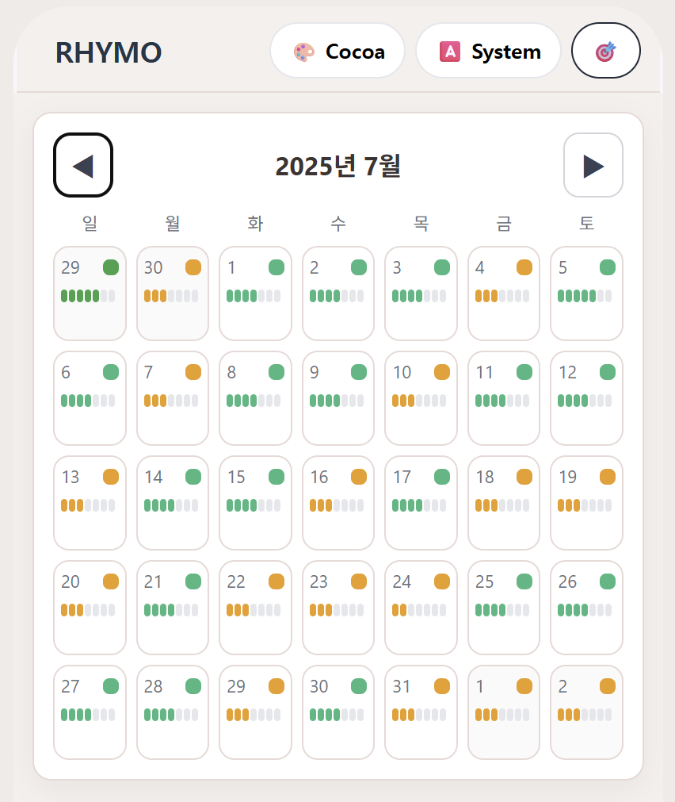

# 2025년 8월 8일 하기 모각코 기록

## 모각코 활동 사진
 

## 목표
- 생성형 AI 대회 React로 구현해보기

## React 구현

생성형 AI 대회에서 서비스 구현을 위해
React와 Visual Studio Code (VS code) 를 이용하여 'Rhymo' 라는 감정분석캘린더 앱을 개발했다.

 

Rhymo라는 앱의 가장 중심이 되는 기술은

'감정 분석'이기 때문에

- 사용자의 흘러가는 감정 흐름에서 패턴을 찾고
- 사용자의 감정을 미리 예측하여
- 생성형 AI가 사용자에게 가장 최적화된 조언을 해주는 게 핵심이다.

그렇기 때문에 위와 같이 리듬분석 코드로 VS code를 통해 'Rhymo'를 구현했다.

위와 같이 달별로 각 날짜의 감정을 7칸의 배터리 모양에 나타낸 화면도 제작했다.

이전에 Unity로 'Rhymo' 앱을 구현하려고 했으나 

확실히 조작법이 어렵고 화면 또한 화질이 깨지거나 기능이 적는 등

React와 VS code에 비하면 활용도가 낮았다.

그렇기 때문에 앞으로도 계속해서 React를 활용해 Rhymo 앱을 개발하고 이를 생성형 AI 대회에 출품할 생각이다.

## 결과
- 생성형 AI 대회 React로 구현
- Visual Studio Code 이용하여 프로젝트 생성 성공
