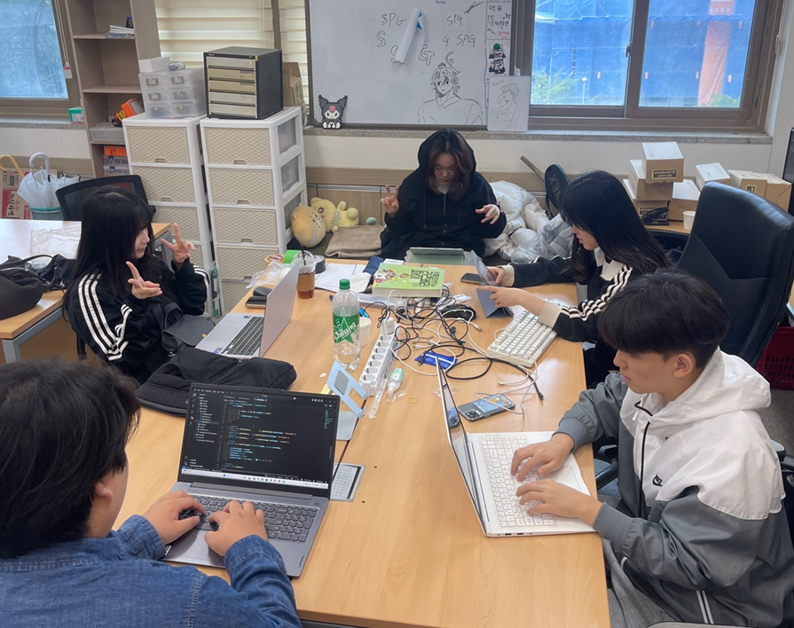

# 2025년 8월 11일 하기 모각코 기록

## 모각코 활동 사진
 

## 목표
- 생성형 AI 대회 React로 구현해보기
- 백준 배열 문제 및 생성형 AI 대회 파이썬 코드로 구현

## React로 구현
 

Rhymo는 서비스 이름에 나타난 것과 같이 Rhythm과 Emotion을 결합한 서비스이다.

대중적으로 널리 알려진 **바이오리듬(23/28/33일)** 이론은 과학적 근거가 거의 없다는 결론이 반복 확인되었다.

이에 반해, **서카디안 시계의 분자 기전**, **사회적 시차**, **계절성 우울증(SAD)**, **일부 비계절성 우울** 등 일정한 주기가 기분과 정신건강에 영향을 준다는 내용이 의학적으로 증명되었다.

이렇게 과학적으로 확립된 생체리듬 문헌을 근거로 Rhymo는 요일/주기 리듬 분석을 이용하여 사용자의 감정 및 정신 건강을 미리 예측하여 상황에 도움이 되는 제대로 된 조언을 하게 된다.

이러한 Rhymo만의 독창적인 요소를 구현하기 위해

나는 VS code에서 감정분석 부분에 가장 공을 들였다.

단순히 키워드만으로 감정을 분석하는 게 아닌, 흐름을 파악하고, 사용자의 성향에 따라 다르게 표현되는 감정을 생성형 AI가 파악할 수 있도록 코드를 구현했다.

뿐만 아니라, AI 피드백 채팅 시스템 또한 개발했는데, 

채팅은
- 사용자의 마지막 입력
- 최근 7일 핵심 이벤트
- 현재 날짜/시간대
- 요일·주기 신호
와 같은 대화 컨텍스트를 포함해 모델을 전달하고,

모델은 동일 문제라도 맥락에 따라 다른 처방을 자연어로 즉시 제공한다.

이러한 시스템의 Rhymo를 구현하기 위해 정말 많은 노력을 하였다.

## 결과
- 생성형 AI 대회 React로 구현 및 코드 이용하여 프로젝트 생성
- 백준 배열 두 문제 풀이 및 생성형 AI 대회 파이썬 코드로 구현
